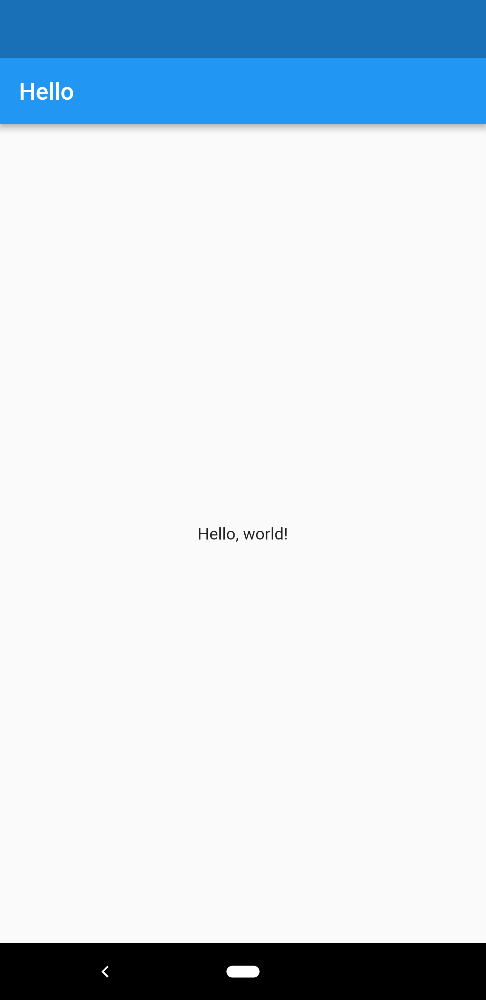

# Building your first Cocoon

The first step is to create a new Flutter project, then replace the contents of `main.dart` with the following:

```dart
import 'package:cocoon/cocoon.dart';
import 'package:flutter/material.dart';
import 'dart:convert';

String _myCocoonDef = '''
{
    "type": "app",
    "title": "My First Cocoon",
    "theme": {
        "primary_color": "#2196F3",
        "accent_color": "#CDDC39",
        "dark": false,
    },
    "home": {
        "type": "scaffold",
        "app_bar": {
            "type": "app_bar",
            "title": "Hello"
        },
        "body": {
            "type": "center",
            "child": {
                "type": "text",
                "text": "Hello, world!"
            }
        }
    }
}
'''

void main() {
    runApp(_MyFirstCocoon());
}

class _MyFirstCocoon extends StatelessWidget {
    @override
    Widget build(BuildContext context) {
        return Cocoon(jsonDecode(_myCocoonDev));
    }
}
```

Run the app, and with any luck this should appear on your device or emulator:



Congratulations! You've built your first Cocoon.